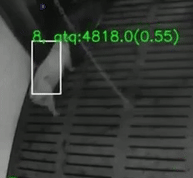

# Uncertain Identity Aware Tracking


### Dataset 

The dataset is available in the dataset folder


### Files 

[Bytetrack](Bytetrack): contains code for getting the tracker transition matrix, add observations, and perform the HMM Tracking 

[forwardBackward.py](Bytetrack/forwardBackward.py): contains code  performing the HMM Tracking 

[ATQ.py](Bytetrack/ATQ.py): contains code  for adding Identifier informations, could be feeder or artificial data for the time

### Requirements

To install the required packages, run the following commands:

```bash
pip install -r Bytetrack_requirements.txt

pip3 install cython
pip3 install 'git+https://github.com/cocodataset/cocoapi.git#subdirectory=PythonAPI'

pip3 install cython_bbox

pip install -r requirements.txt
```

### Tracker matching 
We used Bytetrack as tracker to get the tracker-matching matrix 
type those commands:

```bash
cd path_to_bytetrack/ByteTrack

python3 tools/demo_track_m.py video -f exps/example/mot/yolox_s_mix_det.py -c path_to_bytetrack/ByteTrack/models/yoloX_s_pig_trained_model_400_images.tar --path path_to_bytetrack/ByteTrack/videos/GR77_20200512_111314.mp4  --fuse --save_result --device cpu --fps 25 --conf 0.2 --track_thres 0.2  --match_thresh 0.8 --track_buffer 100  --nms 0.45 --tsize 416 
```
### Reproduce experiments 
**you can reproduce our test with generated visit using the command**

```bash
performance_test.py artificial_visits
```

**To reproduce the test with real feeder data provided by the feeder**
```bash
performance_test.py feeder
```

**To benchmark the models we tested previously you can do**
```bash
performance_test.py tracker_test
```


**To visualize MOTA, IDF1, number of switches etc.**
```bash
you can launch the notebook: Bytetrack/MOT_metric_evaluation/tracking_evaluation.ipynb
```

<center>



*<small> Exemple of tracker identity switch fixed by the HMM based tracking framework for the pig with RWID 4818 </small>*

</center>


